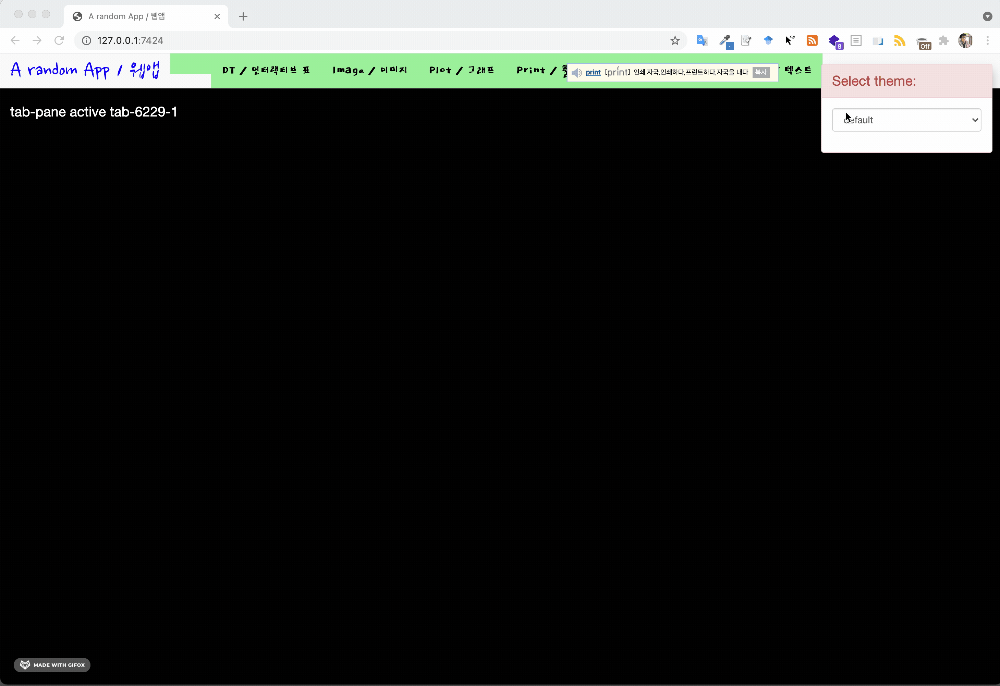

# open_stat

<!-- badges: start -->

<!-- badges: end -->

# Shiny Ipsum

[shinipsum](https://thinkr-open.github.io/shinipsum/)을 바탕으로 오픈 통계팩키지 UI 품평회를 준비합니다.

# [`shinythemes`](https://rstudio.github.io/shinythemes/)

-   [`shinythemes`](https://rstudio.github.io/shinythemes/) 팩키지를 사용해서 외양을 원하는 방식, 특히 색상을 변경시킬 수 있다.

-   `shinythemes/` 디렉토리에 예제가 있다.

-   글꼴을 적용시키기 위해서 `www/` 디렉토리 아래 `open_stat_font.css`와 같은 `.css` 파일에 구글 폰트 등 설정을 통해 원하는 글꼴을 웹앱에 적용시킬 수 있다.

    -   bootstrap selector을 잡아 원하는 곳에 특정 글꼴을 적용시키는 것이 가능하다.

# [`bslib`](https://rstudio.github.io/bslib/)

[`bslib`](https://rstudio.github.io/bslib/) 팩키지를 사용하게 되면 실시간 폰트를 비롯한 여러 방식으로 결과를 변경시킬 수 있다.
